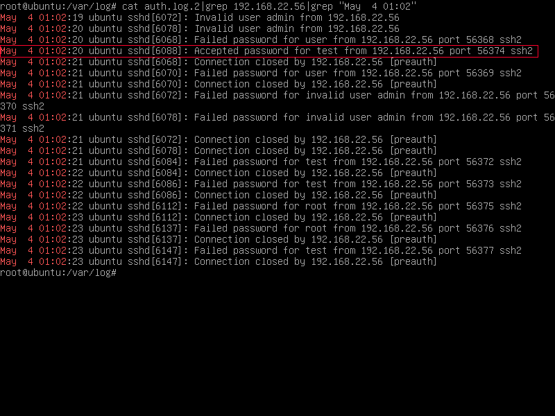
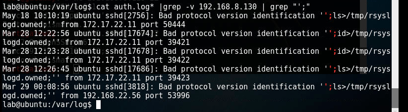
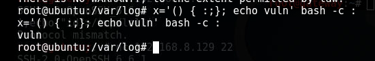
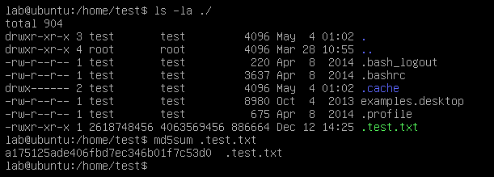
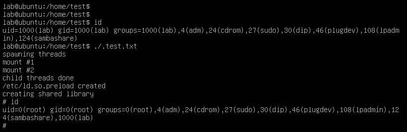
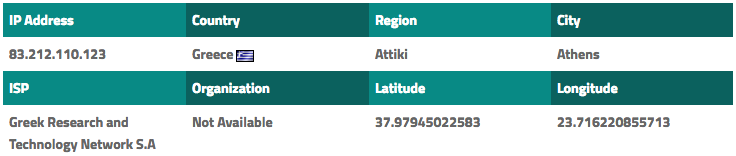

# Επεισόδιο 3 - Linux Forensics

## Πως πήρε πρόσβαση;

Αρχικά παρατηρήσαμε πως η εικονική μηχανή προς ανάλυση έτρεχε το SSH service στην standard TCP port 22. Μετά από ενδελεχή ανάλυση των ψηφιακών πειστηρίων για το συγκεκριμένο service εντοπίσαμε ύποπτη δραστηριότητα από την local IP **192.168.22.56**. Η έναρξη των επιθετικών ενεργειών (**username και password bruteforce**) ανέρχεται στις **4 Μαϊου και ώρα 00:53:22** και κατέληξε στις **4 Μαϊου και ώρα 01:02:20** (διάρκειας περίπου 9 λεπτών) σε επιτυχημένη είσοδο του χρήστη **test** στο εν λόγω σύστημα.



Επίσης εντοπίσαμε εγγραφές που υποδυκνείουν την ευπάθεια του συστήματος στο Shellshock. Η κίνηση προήλθε από την local IP **172.17.22.11** και δεν φαίνεται να εκμεταλλεύτηκε σε σημείο πρόσβασης.






## Τι έκανε από την στιγμή που πήρε πρόσβαση;

Δες βρέθηκαν πειστήρια για τις ακριβής κινήσεις του επιτιθέμενου. Παρ' όλ' αυτά γνωρίζουμε πως ο επιτιθέμενος βρήκε τρόπο να αυξήσει τα δικαιώματά του αρκετά εύκολα.


## Πως αύξησε τα δικαιώματά του;

Στον προσωπικό φάκελο του χρήστη **test** (/home/test) βρέθηκε το εξής εκτελέσιμο:



Γνωρίζοντας την έκδοση Kernel του συστήματος (**3.13.0**) και μετά απο ανάλυση του εκτελέσιμου καταλήξαμε στο συμπέρασμα πως ο επιτιθέμενος αύξησε τα διακαιώματά εκμεταλευόμμενος την γνωστή ευπάθεια **CVE: 2015-1328**.

**Linux Kernel 3.13.0 < 3.19 (Ubuntu 12.04/14.04/14.10/15.04) - overlayfs Local Root Shell**
* https://cve.mitre.org/cgi-bin/cvename.cgi?name=CVE-2015-1328
* https://www.exploit-db.com/exploits/37292/

Εκτελόντας το **.test.txt** έχοντας ήδη πρόσβαση στο σύστημα παίρνουμε το παρακάτω αποτέλεσμα:




## Τι ύποπτο λογισμικό χρησιμοποίησε;

Με root διακαιώματα στο σύστημα, ο επιτιθέμενος εγκατέστησε διάφορα backdoors καθώς και το Adore-ng rootkit για την απόκρυψη των ενεργειών του.

```
crontab -l
find / -type f -name "*~"
diff /etc/ssh/sshd_config{,~}
diff /etc/rc.local{,~}
diff /etc/modules{,~}
```

### [Adore-ng Rootkit](https://github.com/trimpsyw/adore-ng)

```
cat /etc/modules
diff /etc/modules{,~}
find / -type f -name ts_klp.ko
md5sum /lib/modules/3.13.0-32-generic/kernel/lib/ts_klp.ko
file /lib/modules/3.13.0-32-generic/kernel/lib/ts_klp.ko
strings /lib/modules/3.13.0-32-generic/kernel/lib/ts_klp.ko
strings /lib/modules/3.13.0-32-generic/kernel/lib/ts_klp.ko | grep adore
```


### Backdoors

**Persistent reverse root shell back to IP 83.212.110.123:2222**

```
crontab -l
ls -l /usr/bin/ufw /etc/cron.5min/dpkg
lsattr /usr/bin/ufw /etc/cron.5min/dpkg
strings /usr/bin/ufw
strings /etc/cron.5min/dpkg

ls -l /home/lab/.bashrc /etc/profile /etc/skel/.profile
lsattr /home/lab/.bashrc /etc/profile /etc/skel/.profile
```


**SSH root access without password**

```
diff /etc/ssh/sshd_config{,~}
sed -i 's/PermitRootLogin without-password/PermitRootLogin no/' /etc/ssh/sshd_config
```


**[trixd00r](https://github.com/nullsecuritynet/tools/tree/master/backdoor/trixd00r)**

```
diff /etc/rc.local{,~}
file /usr/bin/sshd
md5sum /usr/bin/sshd
strings /usr/bin/sshd
strings /usr/bin/sshd | grep trixd00r
```


## Ποια είναι η IP του κακόβουλου χρήστη.

Η διεύθυνση του κακόβουλου χρήστη είναι: **83.212.110.123**.



## Εκκαθάριση του συστήματος

Αυτοματοποιήσαμε την διαδικασία εκκαθάρισης του συστήματος με το script **cleanup.sh**.
