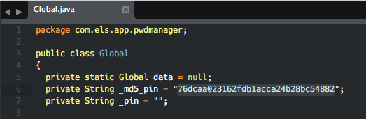
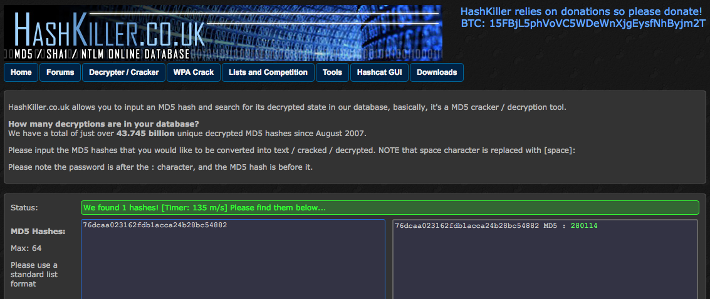
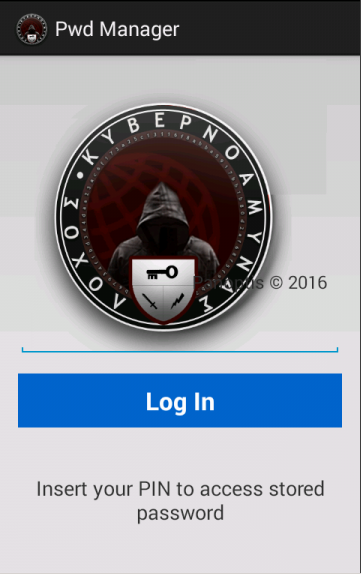
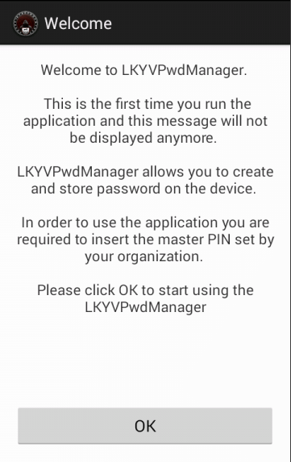
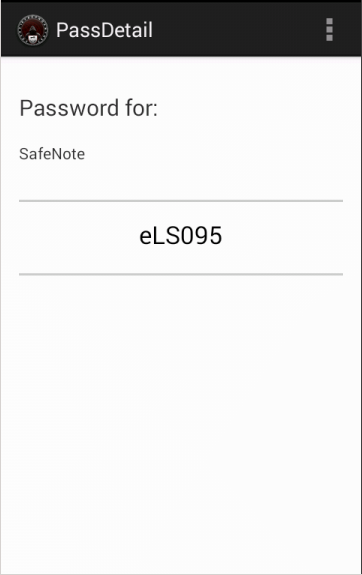
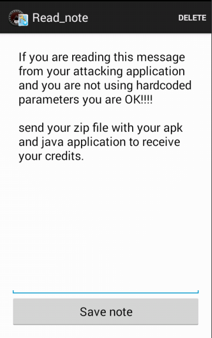
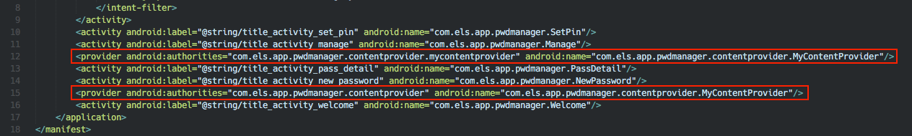
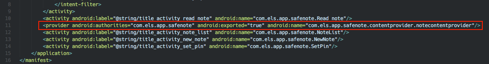

# Επεισόδιο 4 - Mobile Forensics Analysis

Κινητή συσκευή (OS Android) έχει προεγκατεστημένες  2 εφαρμογές οι οποίες φαίνεται πως χρησιμοποιούνταν από τους χρήστες  κινητών τηλεφώνων για να αποθηκεύουν αρχεία με ασφάλεια σε έναν οργανισμό.

Οι εφαρμογές δεν είναι δημόσια διαθέσιμες στο GooglePlay. Μετά από επιτυχημένη εξαγωγή (extract) των *.apk αρχείων των εφαρμογών απεστάλησαν με ασφαλή τρόπο στην Ομάδα Αντιμετώπισης για ανάλυση και penetration test.

* **PwdManager.apk**
  * MD5:    7f86c9457bceb66ee08b89c06dc90d71
  * SHA1:   8c54bc89684d4c502518238486924a0cad09a1c1
  * SHA256: 2d9abdc7b6d4b91fcc7e6f45186bf2c0addbc19f6dd0b7b6dc1be89052ac39b5

* **SafeNote.apk**
  * MD5:    b4328403c0dadf7e114c33a28006c403
  * SHA1:   f3fc882b31834b372b78e9b2a4b94ded68077eaa
  * SHA256: 05bfa2fe04e39cac120158eb6eba9b4222687ddea216945516f73c7aa4015249


## Α΄ Φάση

### Ανάλυση λειτουργίας εφαρμογών

Αρχικά οι εφαρμογές εγκαταστάθηκαν σε Android Emulator. Και οι δύο εφαρμογές ζητούσαν password για περαιτέρω πρόσβαση στα περιεχόμενα.


Χρησιμοποιήσαμε τα εργαλεία **dex2jar** και **jd-gui** για την εξαγωγή του Java κώδικα των δύο εφαρμογών.

Στον παραγώμενο κώδικα για το **PwdManager.apk** εντοπίσαμε το εξής password σε μορφή MD5:



Κάναμε recover το cleartext password χρησιμοποιώντας την online υπηρεσία HashKiller.co.uk:



Μπορέσαμε να κάνουμε login στην εφαρμογή PwdManager επιτυχώς χρησιμοποιώντας το PIN: **280114**. Αποθηκευμένο στην εφαρμογή βρέθηκε το (cleartext) password για το SafeNote όπως φαίνεται παρακάτω.







Επόμενο βήμα ήταν να πάρουμε πρόσβαση στην εφαρμογή SafeNote.



Καταλήγουμε με τα password των δύο εφαρμογών:

* **PwdManager.apk**
  * Password: _280114_

* **SafeNote.apk**
  * Password: _eLS095_

Η εφαρμογή **PwnManager** είναι ένας Password Manager (εξού και η ονομασία) ενώ το **SafeNote** χρησιμοποιείται για την αποθήκευση σημειώσεων. Τα passwords αποθηκεύονται encrypted σε μία SQLite βάση δεδομένων ενώ οι σημειώσεις αποθηκεύονται encrypted σε ξεχωριστά αρχεία .txt με βάση τον τίτλο.


### Εντοπισμός αδυναμιών

Σημαντικό στοιχείο για τον εντοπισμό αδυναμιών είναι οτί οι εφαρμογές έχουν γραφτεί για Android 4.1 (Jellybean).

**PwdManager - Insecure Content Provider Definitions**



**SafeNote - Insecure Content Provider Definition**



Σε εκδόσεις Android <= 4.3 εάν δεν οριστούν τιμές για τις μεταβλητές `android:exported` και `android:grantUriPermissions` ορίζονται ως εξής:

```
android:exported="false"
```

```
android:grantUriPermissions="true"
```

Αυτό σημαίνει οτί έχουμε πρόσβαση στα δεδομένα των εφαρμογών εκμεταλλευόμενοι τους **exported providers**.


## Β΄ Φάση

Δημιουργήσαμε μία εφαρμογή που εκμεταλλεύεται τους content providers του PwdManager και του SafeNote για να διαβάσει τα passwords και τις σημειώσεις σε encrypted μορφή. Επόμενο βήμα ήταν η κωδικοποίηση των decryption functions για τα passwords και τις σημειώσεις ξεχωριστά ωστέ τα δεδομένα να εμφανίζονται στους χρήστες της εφαρμογής μας σε plain text μορφή.


## Authors

rkmylo & h3ph4est7s
